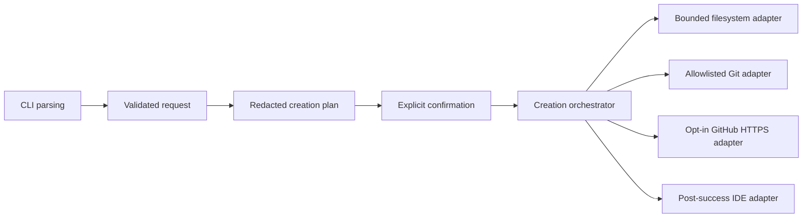

# Architecture

ProjectCreationAutomation separates deterministic policy from external effects.

The domain and planner perform lexical validation only. The CLI composes
production adapters only for `create`; help and `plan` do not discover
executables, read credentials, probe filesystems, or contact external systems.

The orchestrator orders preflight, confirmation, local creation, optional
remote creation/push, and optional IDE launch. Ports make every external
boundary injectable. Tests use in-memory fakes or temporary files and replace
network, Git, discovery, and process launching.

Failures before remote creation use identity-aware local rollback. Once remote
creation may have succeeded, local and remote state is preserved for manual
recovery. IDE failure is a post-success warning and never rolls back a completed
project.
